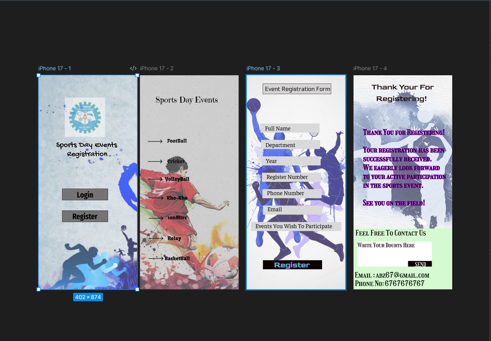

# Ex09 Event Registration Web Application
## Date:14-03-2026

## AIM:
To design, develop and deploy a web application for event registration.

## DESIGN STEPS:

### Step 1:
Create a new frame.

### Step 2:
Select any one preset size of your choice.

### Step 3:
Select the shapes you need.

### Step 4:
Import images as needed.

### Step 5:
Create pages based on your need and link them.

### Step 6:

Validate the HTML and CSS code.

### Step 6:

Publish the website in the given URL.

## DESIGN TOOL:
Figma

## CODE:
HMTL CODE:
```python

<!DOCTYPE html>
<html lang="en">
<head>
  <meta charset="UTF-8">
  <meta name="viewport" content="width=device-width, initial-scale=1.0">
  <meta name="description" content="Exported from Figma">
  <title>Exported Figma Design</title>
  
  <link rel="stylesheet" href="styles.css">
</head>
<body>
<div class="iphone-17-1-1">


<p class="text-4"><span class="text-black">Sports  </span></p>
<p class="text-5"><span class="text-black">Registration</span></p>
<p class="text-6"><span class="text-black">Day</span></p>
<p class="text-7"><span class="text-black">Events</span></p>
<div class="rectangle-1-8"></div>
<div class="rectangle-2-9"></div>
<p class="text-10"><span class="text-rgb-7-0-0">Login</span></p>
<p class="text-11"><span class="text-rgb-7-0-0">Register</span></p>
</div>

</body>
</html>


<!DOCTYPE html>
<html lang="en">
<head>
  <meta charset="UTF-8">
  <meta name="viewport" content="width=device-width, initial-scale=1.0">
  <meta name="description" content="Exported from Figma">
  <title>Exported Figma Design</title>
  
  <link rel="stylesheet" href="styles.css">
</head>
<body>
<div class="iphone-17-2-12">

<p class="text-14"><span class="text-black">Sports Day Events </span></p>


<p class="text-22"><span class="text-rgb-31-30-30">FootBall</span></p>
<p class="text-23"><span class="text-rgb-25-23-23">Cricket</span></p>
<p class="text-24"><span class="text-black">VolleyBall</span></p>
<p class="text-25"><span class="text-black">Kho-Kho</span></p>
<p class="text-26"><span class="text-black">100Mtrs</span></p>
<p class="text-27"><span class="text-black">Relay</span></p>
<p class="text-28"><span class="text-black">BasketBall</span></p>
</div>

</body>
</html>


<!DOCTYPE html>
<html lang="en">
<head>
  <meta charset="UTF-8">
  <meta name="viewport" content="width=device-width, initial-scale=1.0">
  <meta name="description" content="Exported from Figma">
  <title>Exported Figma Design</title>
  
  <link rel="stylesheet" href="styles.css">
</head>
<body>
<div class="iphone-17-3-29">

<div class="rectangle-3-31"></div>
<p class="text-32"><span class="text-black">Event Registration Form</span></p>


<p class="text-41"><span class="text-black">Full Name</span></p>
<p class="text-42"><span class="text-black">Department</span></p>
<p class="text-43"><span class="text-black">Year</span></p>
<p class="text-44"><span class="text-black">Register Number</span></p>
<p class="text-45"><span class="text-black">Phone Number</span></p>
<p class="text-46"><span class="text-black">Email</span></p>
<p class="text-47"><span class="text-black">Events You Wish To Participate</span></p>
<p class="text-48"><span class="text-rgb-63-224-151">Register</span></p>
</div>

</body>
</html>


<!DOCTYPE html>
<html lang="en">
<head>
  <meta charset="UTF-8">
  <meta name="viewport" content="width=device-width, initial-scale=1.0">
  <meta name="description" content="Exported from Figma">
  <title>Exported Figma Design</title>
  
  <link rel="stylesheet" href="styles.css">
</head>
<body>
<div class="iphone-17-4-49">

<div class="rectangle-4-51"></div>
<p class="text-52"><span class="text-rgb-18-0-0">Thank Your For  
</span></p>
<p class="text-53"><span class="text-rgb-27-1-1">Registering!</span></p>
<p class="text-54"><span class="text-rgb-3-4-0">Thank You for Registering!

Your registration has been successfully received.
We eagerly look forward to your active participation in the sports event.

See you on the field!</span></p>
<div class="rectangle-5-55"></div>
<p class="text-56"><span class="text-rgb-14-1-1">Feel Free To Contact Us</span></p>
<p class="text-57"><span class="text-black">Email : abz67@gmail.com</span></p>
<p class="text-58"><span class="text-black">Phone No: 6767676767</span></p>
<div class="rectangle-6-59"></div>
<p class="text-60"><span class="text-rgb-12-0-0">Write Your Doubts Here</span></p>
<div class="rectangle-7-61"></div>
<p class="text-62"><span class="text-rgb-250-255-251">SEND</span></p>
</div>

</body>
</html>

```

CSS CODE:
```python
/* Add font files for Gochi Hand */
@font-face {
  font-family: 'Gochi Hand';
  src: url('fonts/gochi-hand.woff2') format('woff2'),
       url('fonts/gochi-hand.woff') format('woff');
  font-weight: normal;
  font-style: normal;
}

/* Add font files for Fira Sans Extra Condensed */
@font-face {
  font-family: 'Fira Sans Extra Condensed';
  src: url('fonts/fira-sans-extra-condensed.woff2') format('woff2'),
       url('fonts/fira-sans-extra-condensed.woff') format('woff');
  font-weight: normal;
  font-style: normal;
}

/* Add font files for Emilys Candy */
@font-face {
  font-family: 'Emilys Candy';
  src: url('fonts/emilys-candy.woff2') format('woff2'),
       url('fonts/emilys-candy.woff') format('woff');
  font-weight: normal;
  font-style: normal;
}

/* Add font files for Kavoon */
@font-face {
  font-family: 'Kavoon';
  src: url('fonts/kavoon.woff2') format('woff2'),
       url('fonts/kavoon.woff') format('woff');
  font-weight: normal;
  font-style: normal;
}

/* Add font files for Electrolize */
@font-face {
  font-family: 'Electrolize';
  src: url('fonts/electrolize.woff2') format('woff2'),
       url('fonts/electrolize.woff') format('woff');
  font-weight: normal;
  font-style: normal;
}

/* Add font files for Faustina */
@font-face {
  font-family: 'Faustina';
  src: url('fonts/faustina.woff2') format('woff2'),
       url('fonts/faustina.woff') format('woff');
  font-weight: normal;
  font-style: normal;
}

/* Add font files for Goldman */
@font-face {
  font-family: 'Goldman';
  src: url('fonts/goldman.woff2') format('woff2'),
       url('fonts/goldman.woff') format('woff');
  font-weight: normal;
  font-style: normal;
}

/* Add font files for Girassol */
@font-face {
  font-family: 'Girassol';
  src: url('fonts/girassol.woff2') format('woff2'),
       url('fonts/girassol.woff') format('woff');
  font-weight: normal;
  font-style: normal;
}

:root {
  --font-family-gochi-hand: 'Gochi Hand', sans-serif;
  --font-family-fira-sans-extra-condensed: 'Fira Sans Extra Condensed', sans-serif;
  --font-family-emilys-candy: 'Emilys Candy', sans-serif;
  --font-family-kavoon: 'Kavoon', sans-serif;
  --font-family-electrolize: 'Electrolize', sans-serif;
  --font-family-faustina: 'Faustina', sans-serif;
  --font-family-goldman: 'Goldman', sans-serif;
  --font-family-girassol: 'Girassol', sans-serif;
  --text-black: rgba(0, 0, 0, 1);
  --text-rgb-7-0-0: rgba(7, 0, 0, 1);
  --text-rgb-31-30-30: rgba(31, 30, 30, 1);
  --text-rgb-25-23-23: rgba(25, 23, 23, 1);
  --text-rgb-63-224-151: rgba(63, 224, 151, 1);
  --text-rgb-18-0-0: rgba(18, 0, 0, 1);
  --text-rgb-27-1-1: rgba(27, 1, 1, 1);
  --text-rgb-3-4-0: rgba(3, 4, 0, 1);
  --text-rgb-14-1-1: rgba(14, 1, 1, 1);
  --text-rgb-12-0-0: rgba(12, 0, 0, 1);
  --text-rgb-250-255-251: rgba(250, 255, 251, 1);
}

.text-black {
  color: var(--text-black);
}

.text-rgb-7-0-0 {
  color: var(--text-rgb-7-0-0);
}

.text-rgb-31-30-30 {
  color: var(--text-rgb-31-30-30);
}

.text-rgb-25-23-23 {
  color: var(--text-rgb-25-23-23);
}

.text-rgb-63-224-151 {
  color: var(--text-rgb-63-224-151);
}

.text-rgb-18-0-0 {
  color: var(--text-rgb-18-0-0);
}

.text-rgb-27-1-1 {
  color: var(--text-rgb-27-1-1);
}

.text-rgb-3-4-0 {
  color: var(--text-rgb-3-4-0);
}

.text-rgb-14-1-1 {
  color: var(--text-rgb-14-1-1);
}

.text-rgb-12-0-0 {
  color: var(--text-rgb-12-0-0);
}

.text-rgb-250-255-251 {
  color: var(--text-rgb-250-255-251);
}

/* CSS Reset */
* {
  margin: 0;
  padding: 0;
  box-sizing: border-box;
}

body {
  width: 100%;
  min-height: 100vh;
  overflow-x: hidden;
}

img {
  max-width: 100%;
  height: auto;
}

/* Prototype Links */
a.prototype-link {
  text-decoration: none;
  color: inherit;
  display: contents;
}

.image-1-2 {
  flex-grow: 0;
  flex-shrink: 1;
  flex-basis: auto;
  opacity: 0.699999988079071;
  width: 100%;
  height: auto;
}

.image-2-3 {
  flex-grow: 0;
  flex-shrink: 1;
  flex-basis: auto;
  opacity: 0.5299999713897705;
  width: 100%;
  height: auto;
}

.text-4 {
  flex-grow: 0;
  flex-shrink: 1;
  flex-basis: auto;
  text-align: left;
  font-family: var(--font-family-gochi-hand);
  font-weight: normal;
  font-size: 32px;
  text-decoration: none;
  text-transform: none;
  color: var(--text-black);
}

.text-5 {
  flex-grow: 0;
  flex-shrink: 1;
  flex-basis: auto;
  text-align: center;
  font-family: var(--font-family-gochi-hand);
  font-weight: normal;
  font-size: 32px;
  text-decoration: none;
  text-transform: none;
  color: var(--text-black);
}

.text-6 {
  flex-grow: 0;
  flex-shrink: 1;
  flex-basis: auto;
  text-align: left;
  font-family: var(--font-family-gochi-hand);
  font-weight: normal;
  font-size: 32px;
  text-decoration: none;
  text-transform: none;
  color: var(--text-black);
}

.text-7 {
  flex-grow: 0;
  flex-shrink: 1;
  flex-basis: auto;
  text-align: left;
  font-family: var(--font-family-gochi-hand);
  font-weight: normal;
  font-size: 32px;
  text-decoration: none;
  text-transform: none;
  color: var(--text-black);
}

.rectangle-1-8 {
  flex-grow: 0;
  flex-shrink: 1;
  flex-basis: auto;
  background-color: rgba(116, 116, 116, 1);
  border: 1px solid rgba(0, 0, 0, 1);
}

.rectangle-2-9 {
  flex-grow: 0;
  flex-shrink: 1;
  flex-basis: auto;
  background-color: rgba(116, 116, 116, 1);
  border: 1px solid rgba(0, 0, 0, 1);
}

.text-10 {
  flex-grow: 0;
  flex-shrink: 1;
  flex-basis: auto;
  text-align: center;
  font-family: var(--font-family-fira-sans-extra-condensed);
  font-weight: 700;
  font-size: 32px;
  text-decoration: none;
  text-transform: none;
  color: var(--text-rgb-7-0-0);
}

.text-11 {
  flex-grow: 0;
  flex-shrink: 1;
  flex-basis: auto;
  text-align: center;
  font-family: var(--font-family-fira-sans-extra-condensed);
  font-weight: 700;
  font-size: 32px;
  text-decoration: none;
  text-transform: none;
  color: var(--text-rgb-7-0-0);
}

.iphone-17-1-1 {
@media (max-width: 1440px) {
  .iphone-17-1-1 {
    padding-left: 24px;
    padding-right: 24px;
  }
}

@media (max-width: 768px) {
  .iphone-17-1-1 {
    padding-left: 16px;
    padding-right: 16px;
  }
}
  flex-grow: 0;
  flex-shrink: 1;
  background-color: rgba(255, 255, 255, 0.8999999761581421);
}

.image-3-13 {
  flex-grow: 0;
  flex-shrink: 1;
  flex-basis: auto;
  opacity: 0.6000000238418579;
  width: 100%;
  height: auto;
}

.text-14 {
  flex-grow: 0;
  flex-shrink: 1;
  flex-basis: auto;
  text-align: center;
  font-family: var(--font-family-emilys-candy);
  font-weight: normal;
  font-size: 32px;
  text-decoration: none;
  text-transform: none;
  color: var(--text-black);
}

.arrow-1-15 {
  flex-grow: 0;
  flex-shrink: 1;
  flex-basis: auto;
  border: 2px solid rgba(0, 0, 0, 1);
  border: none;
  outline: none;
}

.arrow-2-16 {
  flex-grow: 0;
  flex-shrink: 1;
  flex-basis: auto;
  border: 2px solid rgba(0, 0, 0, 1);
  border: none;
  outline: none;
}

.arrow-3-17 {
  flex-grow: 0;
  flex-shrink: 1;
  flex-basis: auto;
  border: 2px solid rgba(0, 0, 0, 1);
  border: none;
  outline: none;
}

.arrow-4-18 {
  flex-grow: 0;
  flex-shrink: 1;
  flex-basis: auto;
  border: 2px solid rgba(0, 0, 0, 1);
  border: none;
  outline: none;
}

.arrow-5-19 {
  flex-grow: 0;
  flex-shrink: 1;
  flex-basis: auto;
  border: 2px solid rgba(0, 0, 0, 1);
  border: none;
  outline: none;
}

.arrow-6-20 {
  flex-grow: 0;
  flex-shrink: 1;
  flex-basis: auto;
  border: 2px solid rgba(0, 0, 0, 1);
  border: none;
  outline: none;
}

.arrow-7-21 {
  flex-grow: 0;
  flex-shrink: 1;
  flex-basis: auto;
  border: 2px solid rgba(0, 0, 0, 1);
  border: none;
  outline: none;
}

.text-22 {
  flex-grow: 0;
  flex-shrink: 1;
  flex-basis: auto;
  text-align: center;
  font-family: var(--font-family-kavoon);
  font-weight: normal;
  font-size: 20px;
  text-decoration: none;
  text-transform: none;
  color: var(--text-rgb-31-30-30);
}

.text-23 {
  flex-grow: 0;
  flex-shrink: 1;
  flex-basis: auto;
  text-align: center;
  font-family: var(--font-family-kavoon);
  font-weight: normal;
  font-size: 20px;
  text-decoration: none;
  text-transform: none;
  color: var(--text-rgb-25-23-23);
}

.text-24 {
  flex-grow: 0;
  flex-shrink: 1;
  flex-basis: auto;
  text-align: center;
  font-family: var(--font-family-kavoon);
  font-weight: normal;
  font-size: 20px;
  text-decoration: none;
  text-transform: none;
  color: var(--text-black);
}

.text-25 {
  flex-grow: 0;
  flex-shrink: 1;
  flex-basis: auto;
  text-align: center;
  font-family: var(--font-family-kavoon);
  font-weight: normal;
  font-size: 20px;
  text-decoration: none;
  text-transform: none;
  color: var(--text-black);
}

.text-26 {
  flex-grow: 0;
  flex-shrink: 1;
  flex-basis: auto;
  text-align: center;
  font-family: var(--font-family-kavoon);
  font-weight: normal;
  font-size: 20px;
  text-decoration: none;
  text-transform: none;
  color: var(--text-black);
}

.text-27 {
  flex-grow: 0;
  flex-shrink: 1;
  flex-basis: auto;
  text-align: center;
  font-family: var(--font-family-kavoon);
  font-weight: normal;
  font-size: 20px;
  text-decoration: none;
  text-transform: none;
  color: var(--text-black);
}

.text-28 {
  flex-grow: 0;
  flex-shrink: 1;
  flex-basis: auto;
  text-align: center;
  font-family: var(--font-family-kavoon);
  font-weight: normal;
  font-size: 20px;
  text-decoration: none;
  text-transform: none;
  color: var(--text-black);
}

.iphone-17-2-12 {
@media (max-width: 1440px) {
  .iphone-17-2-12 {
    padding-left: 24px;
    padding-right: 24px;
  }
}

@media (max-width: 768px) {
  .iphone-17-2-12 {
    padding-left: 16px;
    padding-right: 16px;
  }
}
  flex-grow: 0;
  flex-shrink: 1;
  flex-basis: auto;
  background-color: rgba(255, 255, 255, 1);
  opacity: 0.800000011920929;
}

.image-4-30 {
  flex-grow: 0;
  flex-shrink: 1;
  flex-basis: auto;
  opacity: 0.699999988079071;
  width: 100%;
  height: auto;
}

.rectangle-3-31 {
  flex-grow: 0;
  flex-shrink: 1;
  flex-basis: auto;
  background-color: rgba(214, 212, 212, 1);
  border: 1px solid rgba(8, 0, 0, 1);
}

.text-32 {
  flex-grow: 0;
  flex-shrink: 1;
  flex-basis: auto;
  text-align: left;
  font-family: var(--font-family-electrolize);
  font-weight: normal;
  font-size: 24px;
  text-decoration: none;
  text-transform: none;
  color: var(--text-black);
}

.rectangle-33 {
  flex-grow: 0;
  flex-shrink: 1;
  flex-basis: auto;
  fill: rgba(217, 217, 217, 1);
  border: none;
  outline: none;
}

.rectangle-34 {
  flex-grow: 0;
  flex-shrink: 1;
  flex-basis: auto;
  fill: rgba(217, 217, 217, 1);
  border: none;
  outline: none;
}

.rectangle-35 {
  flex-grow: 0;
  flex-shrink: 1;
  flex-basis: auto;
  fill: rgba(217, 217, 217, 1);
  border: none;
  outline: none;
}

.rectangle-36 {
  flex-grow: 0;
  flex-shrink: 1;
  flex-basis: auto;
  fill: rgba(217, 217, 217, 1);
  border: none;
  outline: none;
}

.rectangle-37 {
  flex-grow: 0;
  flex-shrink: 1;
  flex-basis: auto;
  fill: rgba(217, 217, 217, 1);
  border: none;
  outline: none;
}

.rectangle-38 {
  flex-grow: 0;
  flex-shrink: 1;
  flex-basis: auto;
  fill: rgba(217, 217, 217, 1);
  border: none;
  outline: none;
}

.rectangle-39 {
  flex-grow: 0;
  flex-shrink: 1;
  flex-basis: auto;
  fill: rgba(217, 217, 217, 1);
  border: none;
  outline: none;
}

.rectangle-40 {
  flex-grow: 0;
  flex-shrink: 1;
  flex-basis: auto;
  fill: rgba(13, 2, 2, 1);
  border: none;
  outline: none;
}

.text-41 {
  flex-grow: 0;
  flex-shrink: 1;
  flex-basis: auto;
  text-align: left;
  font-family: var(--font-family-faustina);
  font-weight: normal;
  font-size: 24px;
  text-decoration: none;
  text-transform: none;
  color: var(--text-black);
}

.text-42 {
  flex-grow: 0;
  flex-shrink: 1;
  flex-basis: auto;
  text-align: left;
  font-family: var(--font-family-faustina);
  font-weight: normal;
  font-size: 24px;
  text-decoration: none;
  text-transform: none;
  color: var(--text-black);
}

.text-43 {
  flex-grow: 0;
  flex-shrink: 1;
  flex-basis: auto;
  text-align: left;
  font-family: var(--font-family-faustina);
  font-weight: normal;
  font-size: 24px;
  text-decoration: none;
  text-transform: none;
  color: var(--text-black);
}

.text-44 {
  flex-grow: 0;
  flex-shrink: 1;
  flex-basis: auto;
  text-align: left;
  font-family: var(--font-family-faustina);
  font-weight: normal;
  font-size: 24px;
  text-decoration: none;
  text-transform: none;
  color: var(--text-black);
}

.text-45 {
  flex-grow: 0;
  flex-shrink: 1;
  flex-basis: auto;
  text-align: left;
  font-family: var(--font-family-faustina);
  font-weight: normal;
  font-size: 24px;
  text-decoration: none;
  text-transform: none;
  color: var(--text-black);
}

.text-46 {
  flex-grow: 0;
  flex-shrink: 1;
  flex-basis: auto;
  text-align: left;
  font-family: var(--font-family-faustina);
  font-weight: normal;
  font-size: 24px;
  text-decoration: none;
  text-transform: none;
  color: var(--text-black);
}

.text-47 {
  flex-grow: 0;
  flex-shrink: 1;
  flex-basis: auto;
  text-align: left;
  font-family: var(--font-family-faustina);
  font-weight: normal;
  font-size: 24px;
  text-decoration: none;
  text-transform: none;
  color: var(--text-black);
}

.text-48 {
  flex-grow: 0;
  flex-shrink: 1;
  flex-basis: auto;
  border: 1px solid rgba(137, 3, 255, 1);
  text-align: left;
  font-family: var(--font-family-goldman);
  font-weight: normal;
  font-size: 32px;
  text-decoration: none;
  text-transform: none;
  color: var(--text-rgb-63-224-151);
}

.iphone-17-3-29 {
@media (max-width: 1440px) {
  .iphone-17-3-29 {
    padding-left: 24px;
    padding-right: 24px;
  }
}

@media (max-width: 768px) {
  .iphone-17-3-29 {
    padding-left: 16px;
    padding-right: 16px;
  }
}
  flex-grow: 0;
  flex-shrink: 1;
  flex-basis: auto;
  background-color: rgba(255, 255, 255, 1);
}

.image-5-50 {
  flex-grow: 0;
  flex-shrink: 1;
  flex-basis: auto;
  opacity: 0.699999988079071;
  width: 100%;
  height: auto;
}

.rectangle-4-51 {
  flex-grow: 0;
  flex-shrink: 1;
  flex-basis: auto;
  background-color: rgba(217, 217, 217, 1);
  border: 1px solid rgba(0, 255, 47, 1);
  opacity: 0.10000000149011612;
}

.text-52 {
  flex-grow: 0;
  flex-shrink: 1;
  flex-basis: auto;
  text-align: left;
  font-family: var(--font-family-goldman);
  font-weight: normal;
  font-size: 32px;
  text-decoration: none;
  text-transform: none;
  color: var(--text-rgb-18-0-0);
}

.text-53 {
  flex-grow: 0;
  flex-shrink: 1;
  flex-basis: auto;
  text-align: left;
  font-family: var(--font-family-goldman);
  font-weight: normal;
  font-size: 32px;
  text-decoration: none;
  text-transform: none;
  color: var(--text-rgb-27-1-1);
}

.text-54 {
  flex-grow: 0;
  flex-shrink: 1;
  flex-basis: auto;
  border: 1px solid rgba(200, 0, 255, 1);
  text-align: left;
  font-family: var(--font-family-girassol);
  font-weight: normal;
  font-size: 30px;
  text-decoration: none;
  text-transform: none;
  color: var(--text-rgb-3-4-0);
}

.rectangle-5-55 {
  flex-grow: 0;
  flex-shrink: 1;
  flex-basis: auto;
  background-color: rgba(213, 249, 208, 1);
}

.text-56 {
  flex-grow: 0;
  flex-shrink: 1;
  flex-basis: auto;
  text-align: left;
  font-family: var(--font-family-girassol);
  font-weight: normal;
  font-size: 30px;
  text-decoration: none;
  text-transform: none;
  color: var(--text-rgb-14-1-1);
}

.text-57 {
  flex-grow: 0;
  flex-shrink: 1;
  flex-basis: auto;
  text-align: left;
  font-family: var(--font-family-girassol);
  font-weight: normal;
  font-size: 30px;
  text-decoration: none;
  text-transform: none;
  color: var(--text-black);
}

.text-58 {
  flex-grow: 0;
  flex-shrink: 1;
  flex-basis: auto;
  text-align: left;
  font-family: var(--font-family-girassol);
  font-weight: normal;
  font-size: 30px;
  text-decoration: none;
  text-transform: none;
  color: var(--text-black);
}

.rectangle-6-59 {
  flex-grow: 0;
  flex-shrink: 1;
  flex-basis: auto;
  background-color: rgba(255, 255, 255, 1);
}

.text-60 {
  flex-grow: 0;
  flex-shrink: 1;
  flex-basis: auto;
  text-align: left;
  font-family: var(--font-family-girassol);
  font-weight: normal;
  font-size: 24px;
  text-decoration: none;
  text-transform: none;
  color: var(--text-rgb-12-0-0);
}

.rectangle-7-61 {
  flex-grow: 0;
  flex-shrink: 1;
  flex-basis: auto;
  background-color: rgba(10, 0, 0, 1);
}

.text-62 {
  flex-grow: 0;
  flex-shrink: 1;
  flex-basis: auto;
  text-align: left;
  font-family: var(--font-family-girassol);
  font-weight: normal;
  font-size: 24px;
  text-decoration: none;
  text-transform: none;
  color: var(--text-rgb-250-255-251);
}

.iphone-17-4-49 {
@media (max-width: 1440px) {
  .iphone-17-4-49 {
    padding-left: 24px;
    padding-right: 24px;
  }
}

@media (max-width: 768px) {
  .iphone-17-4-49 {
    padding-left: 16px;
    padding-right: 16px;
  }
}
  flex-grow: 0;
  flex-shrink: 1;
  flex-basis: auto;
  background-color: rgba(255, 255, 255, 1);
}
```


## OUTPUT:



## RESULT:
The program to design, develop and deploy a web application for event registration is completed successfully.
